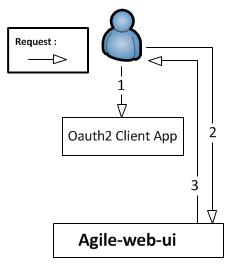

#Implicit Authentication Example

The implicit authentication enables applications that are not capable of generating server side requests to authenticate the client, to still rely on an identity provider.
A typical example of this, is a case in which an application that runs in a browser and executes JavaScript code. In this simplified authentication grant flow, the web browser
obtains a token directy from IDM through a redirection.

The key consideration when this authentication grant is used is that the browser obtains access to the token directly. On the contrary, in the authorization code flow, the browser only obtains an authorization code, which is normally useless unless the browser managed to obtain the secret of the client application (which should never be shared with the browser).


## Example Set Up

First of all, we need to create the first user with IDM, if it not already created. To achieve this, execute the following command in the scripts folder of agile-idm-web-ui:
```
  node createUser.js --username=bob --password=secret  --auth=agile-local
```
Now that a user exists,  an oauth2 client must be registered. To achieve this, execute the following command line from the agile-idm-web-ui script folder. If any of the parameters of the command line execution are changed, the configuration file for the example available in the “conf” folder of the oauth2 client example should be updated:
```
node createClient.js --client=MyAgileClient --name="My first example as IDM client" --secret="Ultrasecretstuff" --owner=bob --auth_type=agile-local --uri=http://localhost:3010/
```
**note**: that this callback is different than the authorization code. It returns directly to a URL that servers HTML to the browser. In the case of an authorization code flow, this URL needs to redirect to an endpoint in the server that is capable of exchanging the authorization code for a valid access token after presenting the client credentials. In this case, the browser will get the access token directly after following the redirection to http://localhost:3010/index.html, therefore removing the burden on the server side to exchange the token. However, the browser (and the client side JavaScript code) needs to be trusted, otherwise this mechanism should not be used.

Afterwards, run identity management by executing this in the root of the agile-idm-web-ui folder:
```
  node app.js
```
And subsequently run the oauht2 client example by executing this in the root of the oauth2 client example project:
```
  node index.js
```
Then visit http://localhost:3010/

##Overview

Assuming that an oauth2 client has been registered in AGILE IDM, the flow to obtain an access token for any AGILE user using the implicit grant is depicted in the following picture.

<table align="center">
	<tr>
		<td></td>
	</tr>
	<tr align="center">
		<td>
			AGILE IDM interaction with Oauth2 clients
		</td>
	</tr>
</table>

From step 1 to 3, the authentication between IDM and the Oauth2 client occurs; however, it must be noted that in case AGILE IDM relies on another identity provider, such as google, to authenticate the user, additional steps will take place between step 2 and 3. In each step the following actions take place:

1. the user opens the Oauth2 client application, but he/she is not authenticated yet.

2. the Oauth2 client App redirects the user to AGILE IDM presenting its client id and a redirect URL that will be called by IDM on successful authentication of the user (if this URL matches the registration of the oauth client). Subsequently, the user authenticates with AGILE IDM using any of the authentication providers available.

3. On successful user authentication, IDM redirects the user with an access token and token type including the token and the token type as an URL fragment according to RFC 6749. At this point the browser can parse the URI and obtain the token and the token type to use it afterwards.

From this point on, the browser can use this token to interact with IDM, or with any other AGILE component that has been integrated with AGILE IDM.
